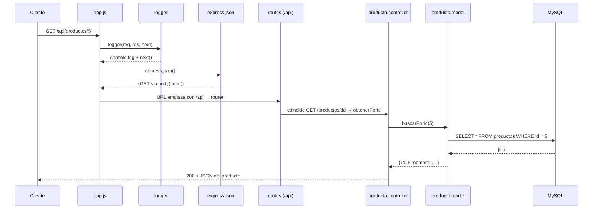

# El recorrido de un request

> **Archivos:** todos los de [`src/`](../../Navaja-Style/backend/src/) · **Conceptos previos:** [request y response](glosario.md#request-y-response), [middleware](glosario.md#middleware), [MVC](glosario.md#mvc)

## En una frase

Antes de mirar cada archivo por separado, conviene ver **el viaje completo** de un pedido: entra por `server.js`, atraviesa una cadena de funciones armada en `app.js`, llega a un controller, baja a la base de datos y vuelve como JSON. Si en algún punto algo sale mal, el pedido se desvía hacia el manejador de errores.

## Las capas

```
src/
├── server.js        → arranca el proceso y abre el puerto
├── app.js           → arma la cadena de middlewares (el "orden de la línea de montaje")
├── routes/          → decide QUÉ función atiende cada método + URL
├── middlewares/     → funciones que se meten en el medio (log, auth, errores)
├── controllers/     → lógica del endpoint: valida, llama al modelo, elige la respuesta
├── models/          → habla con MySQL (SQL)
├── config/          → conexión a la base (pool)
└── utils/           → piezas reutilizables (errores, fábricas CRUD, hash, token)
```

Cada capa **solo conoce a la de abajo**: las rutas conocen a los controllers, los controllers a los modelos, los modelos al pool. Ninguna capa de abajo sabe nada de HTTP salvo los controllers. **Por qué**: si mañana cambia la base de datos, solo se tocan los modelos; si cambia el formato de las URLs, solo las rutas. **Si estuviera todo junto** (como en los primeros labs, con SQL adentro del `app.get(...)`), cualquier cambio obliga a releer y tocar todo.

## Camino feliz: `GET /api/productos/5`



Paso a paso:

1. **`server.js`** ya estaba escuchando en el puerto 3000. Node recibe la conexión y se la pasa a la app de Express. → [02-arranque.md](02-arranque.md)
2. **`logger`** imprime `2026-10-06T... GET /api/productos/5` y llama a `next()`. → [03-middlewares.md](03-middlewares.md#logger)
3. **`express.json()`** mira si el body viene en JSON; en un `GET` no hay body, así que pasa de largo.
4. **`app.use("/api", routes)`**: la URL empieza con `/api`, entonces entra al router principal, que prueba uno por uno los routers de cada entidad hasta que `producto.routes.js` coincide con `GET /productos/:id` y guarda `"5"` en `req.params.id`. → [04-rutas.md](04-rutas.md)
5. **`obtenerPorId`** convierte `"5"` en el número `5`, le pide al modelo el registro y responde con `res.json(item)`. Al responder, **la cadena termina**: los middlewares que quedan abajo (`notFound`, `errorHandler`) nunca se ejecutan. → [05-controllers.md](05-controllers.md)
6. **`buscarPorId`** ejecuta un `SELECT` parametrizado usando una conexión del pool. → [06-modelos-y-base-de-datos.md](06-modelos-y-base-de-datos.md)

## Camino con error: `GET /api/productos/999`

Igual que arriba hasta el paso 5, pero el modelo devuelve `undefined` (no hay fila). Entonces el controller hace:

```js
throw new ApiError(404, `Producto con id 999 no encontrado`);
```

Ese `throw` ocurre dentro de una función `async`, así que la promesa queda rechazada. Express 5 la detecta y hace `next(error)` por nosotros: **saltea todos los middlewares normales** y salta directo a `errorHandler`, que responde `404 {"error": "Producto con id 999 no encontrado"}`. → [07-errores.md](07-errores.md)

## Camino sin ruta: `GET /api/no-existe`

Ningún router coincide. El request "cae" por toda la cadena hasta `notFound`, que crea un `ApiError(404)` y llama a `next(error)` → `errorHandler` responde `404 {"error": "Ruta no encontrada: GET /api/no-existe"}`.

## Camino protegido: `GET /api/usuarios/me`

Esta ruta tiene **un middleware extra en el medio**: `verificarAutenticacion`. Antes de llegar al controller, revisa el header `Authorization`. Si el token falta o es inválido, responde `401` ahí mismo y el controller nunca se ejecuta. Si es válido, guarda los datos del usuario en `req.usuario` y llama a `next()`. → [08-autenticacion.md](08-autenticacion.md)

## Idea clave

Todo el backend es **una lista ordenada de funciones** por las que pasa cada request. Cada función tiene tres opciones: responder (y terminar), pasar el turno con `next()`, o reportar un error con `next(error)` / `throw`. Entender eso es entender el 80% de Express.
