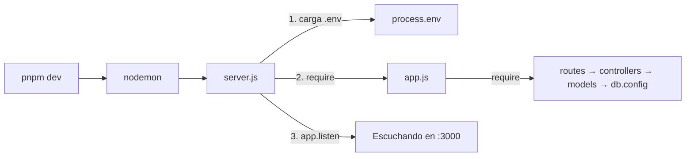

# Arranque: `package.json`, `server.js` y `app.js`

> **Archivos:** [`package.json`](../../Navaja-Style/backend/package.json), [`src/server.js`](../../Navaja-Style/backend/src/server.js), [`src/app.js`](../../Navaja-Style/backend/src/app.js), [`.env.example`](../../Navaja-Style/backend/.env.example)
> **Conceptos previos:** [módulo](glosario.md#módulo-require--moduleexports), [variables de entorno](glosario.md#dotenv--variables-de-entorno), [middleware](glosario.md#middleware)

## En una frase

`server.js` **enciende** el servidor (carga la configuración y abre el puerto) y `app.js` **define** la aplicación (en qué orden pasa cada request por cada función).

## Dónde encaja



## `package.json`: dependencias y scripts

```json
// package.json
"main": "src/server.js",
"scripts": {
  "dev": "nodemon src/server.js"
},
"dependencies": {
  "dotenv": "^17.4.2",
  "express": "^5.2.1",
  "mysql2": "^3.24.3"
},
"devDependencies": {
  "nodemon": "^3.1.14"
}
```

- **`dependencies`** son las librerías que el servidor necesita para funcionar:
  - `express`: el framework HTTP (ver [glosario](glosario.md#express)).
  - `mysql2`: el "driver", la librería que sabe hablar el protocolo de MySQL. Se usa su versión con promesas (`mysql2/promise`) para poder hacer `await`.
  - `dotenv`: carga el archivo `.env` en `process.env`.
- **`devDependencies`** son herramientas que solo se usan mientras desarrollamos. `nodemon` reinicia el servidor solo cada vez que guardás un archivo. **Si no estuviera**: tendrías que cortar y volver a correr `node src/server.js` con cada cambio.
- `"dev": "nodemon src/server.js"`: por eso se levanta con `pnpm dev`.
- `devEngines.packageManager: pnpm`: indica que el proyecto se maneja con **pnpm** y no con npm. pnpm guarda las dependencias de forma más compacta (por eso en `node_modules/` las dependencias internas están dentro de `node_modules/.pnpm/`).
- **Express 5** (y no 4) importa: cambia cómo se manejan los errores en funciones `async`. Ver [07-errores.md](07-errores.md#express-5-atrapa-los-errores-de-las-funciones-async).

## `server.js`: el punto de entrada

```js
// src/server.js:1-9
require("dotenv").config();

const app = require("./app");

const PORT = process.env.PORT || 3000;

app.listen(PORT, () => {
  console.log(`Servidor escuchando en http://localhost:${PORT}`);
});
```

- `require("dotenv").config()`: lee `.env` y copia cada línea `CLAVE=valor` a `process.env.CLAVE`. **Por qué va en la línea 1, antes que todo**: varios módulos leen `process.env` **en el momento en que se cargan**, no cuando se usan:
  - [`db.config.js`](../../Navaja-Style/backend/src/config/db.config.js) crea el pool con `process.env.DB_HOST`, `DB_USER`, etc. apenas se hace `require`.
  - [`token.js`](../../Navaja-Style/backend/src/utils/token.js) guarda `const SECRETO = process.env.AUTH_SECRET` al cargarse.

  Como `require("./app")` dispara en cadena la carga de rutas → controllers → modelos → `db.config`, **si dotenv se cargara después**, esas constantes ya habrían quedado en `undefined` y el servidor no podría conectarse a MySQL ni firmar tokens. El orden de estas dos líneas es una **regla**, no estilo.
- `process.env.PORT || 3000`: usa el puerto del `.env` y, si no está definido, `3000`. El `||` devuelve el primer valor "verdadero".
- `app.listen(PORT, callback)`: le pide al sistema operativo que le avise a Node cada vez que llegue una conexión a ese puerto. El callback se ejecuta una sola vez, cuando el puerto quedó abierto.

### ¿Por qué separar `server.js` de `app.js`?

Es una **convención** muy común en proyectos Express: `app.js` *describe* la aplicación y la exporta sin encenderla; `server.js` la *enciende*. La ventaja práctica es que la app se puede importar desde otro lado (por ejemplo, desde tests automáticos) sin abrir un puerto real. Hoy el proyecto no tiene tests, pero la separación ya deja el camino preparado.

## `app.js`: el orden de la cadena

```js
// src/app.js:1-16
const express = require("express");
const routes = require("./routes");
const logger = require("./middlewares/logger.middleware");
const { notFound, errorHandler } = require("./middlewares/errorHandler.middleware");

const app = express();

app.use(logger);
app.use(express.json());

app.use("/api", routes);

app.use(notFound);
app.use(errorHandler);

module.exports = app;
```

- `const app = express()`: crea la aplicación. Por dentro, es una función que Node va a llamar con cada request, más una **lista vacía de middlewares** (el *stack*).
- `app.use(fn)`: **agrega `fn` al final de esa lista**. Para cada request, Express recorre la lista **de arriba hacia abajo, en el orden en que se declaró**. Cada función decide si responde (y el recorrido termina) o llama a `next()` para seguir. Por eso **el orden de estas líneas es el orden de ejecución**, y cambiarlo cambia el comportamiento.

Recorramos la lista:

1. **`logger` primero**: queremos registrar *todos* los requests, incluso los que después terminan en 404 o en error. **Si estuviera debajo de las rutas**: solo se loguearían los requests que ninguna ruta atendió (las rutas responden y cortan la cadena antes de llegar al logger).
2. **`express.json()` segundo**: es un middleware que trae Express. Lee el body del request y, si el header `Content-Type` es `application/json`, lo convierte de texto a objeto y lo guarda en `req.body`. **Por qué antes de las rutas**: los controllers usan `req.body`; si el parser estuviera después, cuando el controller se ejecute el body todavía no estaría procesado. **Si no estuviera**: `req.body` sería siempre `undefined`.
   - Detalle de Express 5 (verificado con `body-parser` 2.3.0): si el cliente **no** manda `Content-Type: application/json`, el parser no hace nada y `req.body` queda `undefined` (no `{}`). Por eso los controllers de usuario chequean `bodyEsObjeto(req.body)`.
   - Si el JSON está mal escrito (`{malo`), el parser llama a `next(error)` con un error que trae `status: 400`. Ver [Observaciones](#observaciones).
3. **`app.use("/api", routes)`**: monta el router principal bajo el prefijo `/api`. Esto hace dos cosas: (a) el router solo se ejecuta si la URL empieza con `/api`; (b) adentro del router, `req.url` llega **sin** el prefijo. Por eso en los archivos de rutas se escribe `/productos` y no `/api/productos`. **Por qué un prefijo**: separa las URLs de la API de cualquier otra cosa que el servidor pudiera servir (por ejemplo, el frontend compilado) y deja lugar para versionar (`/api/v2`) en el futuro.
4. **`notFound` y `errorHandler` al final**: `notFound` atrapa los requests que ninguna ruta respondió, y `errorHandler` convierte cualquier error en una respuesta JSON. Tienen que ir últimos *por cómo funcionan*: ver [03-middlewares.md](03-middlewares.md#notfound-por-qué-va-después-de-todas-las-rutas) y [07-errores.md](07-errores.md).
- `module.exports = app`: exporta la app **sin** encenderla; `server.js` es quien llama a `listen`.

## Regla vs. convención

| Aspecto | ¿Regla o convención? | Por qué |
|---|---|---|
| `dotenv` antes de `require("./app")` | Regla | Los módulos leen `process.env` al cargarse. |
| Orden de los `app.use` | Regla de Express | El orden de declaración es el orden de ejecución. |
| `express.json()` antes de las rutas | Regla | Las rutas necesitan `req.body` ya procesado. |
| `notFound` y `errorHandler` al final | Regla | Ver [03-middlewares.md](03-middlewares.md). |
| Prefijo `/api` | Convención | Organización de URLs. |
| Separar `server.js` / `app.js` | Convención | Permite importar la app sin abrir un puerto. |

## Probalo

```bash
cp .env.example .env    # y completar los datos de MySQL y AUTH_SECRET
pnpm install
pnpm dev
```

Salida esperada:

```
Servidor escuchando en http://localhost:3000
```

```bash
curl -i http://localhost:3000/api/categorias
```

En la consola del servidor aparece la línea del logger, y el cliente recibe `200` con un array JSON.

## Errores comunes

- **`Error: connect ECONNREFUSED` o `Access denied for user`** al primer request → MySQL no está corriendo o los datos del `.env` están mal. El pool no se conecta al arrancar, sino **en la primera consulta**, por eso el servidor "levanta bien" y falla después.
- **`req.body` es `undefined`** → el cliente no mandó `Content-Type: application/json`.
- **El login responde 500** → falta `AUTH_SECRET` en `.env` (ver [08-autenticacion.md](08-autenticacion.md#observaciones)).

## Observaciones

- **Un JSON mal formado responde 500 en vez de 400.** `express.json()` genera un error con `err.status = 400` (verificado: `type: "entity.parse.failed"`), pero `errorHandler` solo respeta el status de los `ApiError`; a cualquier otro error le pone 500 y "Error interno del servidor". El cliente recibe un 500 por un error que es suyo. Ver [07-errores.md](07-errores.md#observaciones).
- **No se valida la configuración al arrancar.** Si falta una variable del `.env`, el servidor arranca igual y falla recién cuando se usa (primera consulta, primer login).
