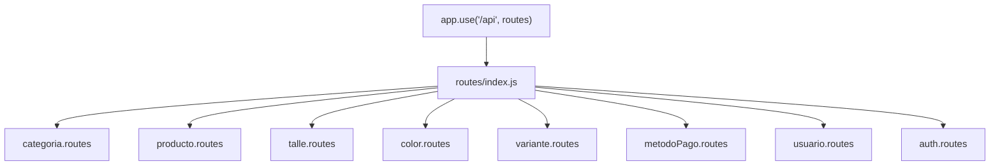

# Rutas

> **Archivos:** [`src/routes/index.js`](../../Navaja-Style/backend/src/routes/index.js) y cada [`src/routes/*.routes.js`](../../Navaja-Style/backend/src/routes/)
> **Depende de:** [02-arranque.md](02-arranque.md) · **Lo usa:** [05-controllers.md](05-controllers.md)
> **Conceptos previos:** [router](glosario.md#router), [endpoint](glosario.md#endpoint), [método HTTP](glosario.md#método-http)

## En una frase

Las rutas son la "tabla de direcciones" de la API: dicen **qué función** atiende cada combinación de método HTTP + URL. No contienen lógica; solo conectan URLs con controllers.

## Dónde encaja



## Un archivo de rutas por entidad

```js
// src/routes/producto.routes.js:1-12
const { Router } = require("express");
const productoController = require("../controllers/producto.controller");

const router = Router();

router.post("/productos", productoController.crear);
router.get("/productos", productoController.listar);
router.get("/productos/:id", productoController.obtenerPorId);
router.put("/productos/:id", productoController.actualizar);
router.delete("/productos/:id", productoController.eliminar);

module.exports = router;
```

- `Router()`: crea un router, una "mini app" con su propia lista de rutas y middlewares. **Por qué un router por archivo**: cada entidad queda aislada en su archivo y `app.js` no crece con cada endpoint nuevo.
- `router.get(ruta, handler)`: registra que un `GET` a esa ruta lo atiende `handler`. Igual con `post`, `put`, `delete`. **El método importa**: `GET /productos` y `POST /productos` son endpoints distintos aunque compartan URL. Esto sigue el estilo [REST](glosario.md#api-rest): la URL dice *sobre qué recurso*, el método dice *qué hacer*.
- `:id`: es un **parámetro de ruta**. El `:` le dice a Express "en esta posición acepto cualquier valor y guardalo". Para `GET /productos/5`, Express deja `req.params.id === "5"`. Ojo: siempre llega como **texto**, por eso el controller hace `Number(req.params.id)`.
- `productoController.crear` (sin paréntesis): se pasa **la función**, no se la ejecuta. Express la va a llamar más tarde, cuando llegue un request, pasándole `(req, res, next)`. **Si escribieras `productoController.crear()`**: la función se ejecutaría una vez al arrancar, sin `req`, y explotaría.

### La tabla CRUD que se repite

Las seis entidades del catálogo (`categorias`, `productos`, `talles`, `colores`, `variantes`, `metodos-pago`) siguen exactamente el mismo patrón:

| Método | URL | Controller | Qué hace | Éxito |
|---|---|---|---|---|
| `POST` | `/api/<entidad>` | `crear` | Crea un registro | `201` + registro creado |
| `GET` | `/api/<entidad>` | `listar` | Lista todos | `200` + array |
| `GET` | `/api/<entidad>/:id` | `obtenerPorId` | Trae uno | `200` + registro / `404` |
| `PUT` | `/api/<entidad>/:id` | `actualizar` | Modifica campos | `200` + registro actualizado / `404` |
| `DELETE` | `/api/<entidad>/:id` | `eliminar` | Borra | `200` + `{ mensaje }` / `404` |

URLs en plural y en minúscula, con guion para separar palabras (`metodos-pago`): es una **convención** REST habitual (la URL nombra una *colección* de recursos).

## Rutas de usuario y autenticación

```js
// src/routes/auth.routes.js:7-8
router.post("/auth/login", authController.login);
router.post("/auth/register", usuarioController.crear);
```

```js
// src/routes/usuario.routes.js:7-8
router.get("/usuarios/me", verificarAutenticacion, usuarioController.obtenerMe);
router.put("/usuarios/me", verificarAutenticacion, usuarioController.actualizarMe);
```

- `/auth/...` agrupa las acciones de **identificarse** (login y registro). Son **públicas**: alguien que todavía no tiene cuenta tiene que poder registrarse.
- `/auth/register` llama a `usuarioController.crear`: el registro *crea un usuario*, así que la lógica vive en el controller de usuarios, aunque la URL esté bajo `/auth`. Esto viene del commit `76c02f0` ("Separar la lógica de usuarios de la de autenticación"): `auth.controller` quedó solo con `login`.
- `/usuarios/me` usa `me` en vez de un id. **Por qué**: el usuario no elige *a quién* consulta; el servidor saca el id **del token** (`req.usuario.id`). **Si fuera `/usuarios/:id`**, cualquier usuario logueado podría pedir `/usuarios/7` y ver o modificar el perfil de otro, a menos que se agregara un chequeo extra.
- `verificarAutenticacion` en el medio: es un [middleware de ruta](03-middlewares.md#middlewares-globales-vs-de-ruta). Si no hay token válido, responde 401 y el controller nunca se ejecuta.

## `index.js`: juntar todos los routers

```js
// src/routes/index.js:10-21
const router = Router();

router.use(categoriaRoutes);
router.use(productoRoutes);
router.use(talleRoutes);
router.use(colorRoutes);
router.use(varianteRoutes);
router.use(metodosPagoRoutes);
router.use(usuarioRoutes);

router.use(authRoutes);
module.exports = router;
```

- Crea un router "padre" y le monta los routers de cada entidad **sin prefijo** (`router.use(x)` en vez de `router.use("/productos", x)`). Por eso cada archivo de rutas escribe su URL completa (`/productos/:id`).
- `app.js` monta este router padre bajo `/api`, así que la URL final es `/api` + `/productos/:id`.
- **Por qué un `index.js`**: `require("./routes")` en `app.js` carga automáticamente `routes/index.js` (Node busca `index.js` cuando se le pide una carpeta). Así `app.js` tiene una sola línea para todas las rutas y no hay que tocarlo al agregar una entidad.
- **El orden de los `router.use`** es el orden en que Express prueba cada router. Hoy **no importa**, porque ninguna URL se repite entre archivos. Importaría si dos routers definieran rutas que se pisan (por ejemplo `/productos/:id` en un archivo y `/productos/destacados` en otro: el primero que coincida gana, y `:id` aceptaría `"destacados"`).

## Agregar una entidad nueva

1. Crear el modelo con `crearModeloCRUD` ([06](06-modelos-y-base-de-datos.md)).
2. Crear el controller con `crearControllerCRUD` ([05](05-controllers.md)).
3. Crear `src/routes/<entidad>.routes.js` copiando el patrón de arriba.
4. Importarlo y montarlo con `router.use(...)` en `routes/index.js`.

## Regla vs. convención

| Aspecto | ¿Regla o convención? | Por qué |
|---|---|---|
| Pasar la función sin `()` | Regla | Express la llama después con `(req, res, next)`. |
| `req.params.id` es texto | Regla | Las URLs son texto. |
| Middlewares de ruta de izquierda a derecha | Regla de Express | Orden de declaración = orden de ejecución. |
| Un router por entidad + `index.js` | Convención | Organización. |
| URLs en plural, minúscula, con guiones | Convención REST | Legibilidad y estándar de la industria. |
| `/usuarios/me` en vez de `/usuarios/:id` | Decisión de seguridad | El id sale del token, no del cliente. |

## Probalo

```bash
curl -i http://localhost:3000/api/productos
curl -i http://localhost:3000/api/productos/1
curl -i -X POST http://localhost:3000/api/categorias \
  -H "Content-Type: application/json" \
  -d '{"nombre": "Remeras"}'
```

Los ejemplos de login y registro listos para ejecutar desde VS Code están en [`api-test.http`](../../Navaja-Style/backend/api-test.http); los del catálogo, en el [`README.md`](../../Navaja-Style/backend/README.md#5-probar-los-endpoints-con-postman).

## Observaciones

- **Las rutas del catálogo no están protegidas.** Cualquiera, sin token, puede crear, modificar o borrar categorías, productos, talles, colores, variantes y métodos de pago. La base ya tiene el campo `usuarios.rol` (`cliente` / `admin`), pero todavía no se usa para restringir nada. Haría falta un middleware que, después de `verificarAutenticacion`, verifique `req.usuario.rol === "admin"` en los `POST`, `PUT` y `DELETE`.
- **El `README.md` del backend está desactualizado** en la sección de autenticación: documenta `GET /api/auth/me`, que ya no existe; ahora es `GET /api/usuarios/me`. Lo mismo pasa en [`api-test.http`](../../Navaja-Style/backend/api-test.http) (líneas 40-47): esos requests hoy responden 404.
