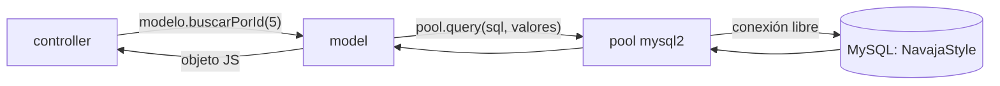
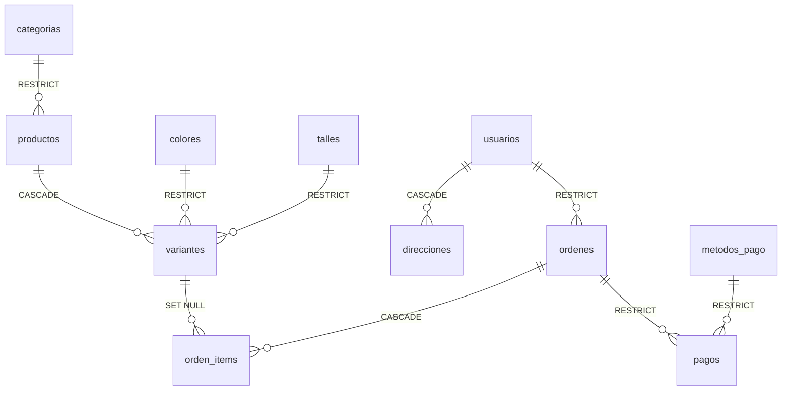

# Modelos y base de datos

> **Archivos:** [`src/config/db.config.js`](../../Navaja-Style/backend/src/config/db.config.js), [`src/utils/crud.model.js`](../../Navaja-Style/backend/src/utils/crud.model.js), [`src/models/*.model.js`](../../Navaja-Style/backend/src/models/), [`sql/schema.sql`](../../Navaja-Style/backend/sql/schema.sql)
> **Lo usa:** [05-controllers.md](05-controllers.md)
> **Conceptos previos:** [pool de conexiones](glosario.md#pool-de-conexiones), [query parametrizada](glosario.md#query-parametrizada-placeholders-), [SQL injection](glosario.md#sql-injection), [constraint](glosario.md#constraint-restricción-de-base-de-datos), [foreign key](glosario.md#foreign-key-clave-foránea)

## En una frase

Los modelos son la **única parte del backend que escribe SQL**. Reciben datos de JavaScript, arman la consulta de forma segura, la mandan a MySQL a través de un pool de conexiones y devuelven el resultado como objetos.

## Dónde encaja



## La conexión: `db.config.js`

```js
// src/config/db.config.js:1-11
const mysql = require("mysql2/promise");

const pool = mysql.createPool({
  host: process.env.DB_HOST,
  port: process.env.DB_PORT,
  user: process.env.DB_USER,
  password: process.env.DB_PASSWORD,
  database: process.env.DB_NAME,
});

module.exports = pool;
```

- `require("mysql2/promise")`: `mysql2` trae dos versiones; la de `/promise` devuelve [promesas](glosario.md#promesa), lo que permite escribir `await pool.query(...)`. **Con la versión normal** habría que usar callbacks (funciones que se pasan para "avisame cuando termines"), que se anidan y se vuelven difíciles de leer.
- `createPool` en vez de `createConnection`: un **pool** mantiene varias conexiones abiertas y las reparte. **Por qué**: abrir una conexión a MySQL es caro (red + autenticación). Con una sola conexión compartida, los requests simultáneos harían fila; abriendo una por request, se pagaría ese costo cada vez. Valores por defecto en mysql2 3.24.3 (verificado en `lib/pool_config.js`): hasta **10 conexiones** (`connectionLimit`), y si están todas ocupadas, los pedidos **esperan en cola** (`waitForConnections: true`) en vez de fallar.
- El pool **no se conecta al crearse**: abre conexiones recién cuando llega la primera consulta. Por eso, si MySQL está apagado, el servidor arranca bien y falla en el primer request.
- Los datos salen de `process.env` (cargados por dotenv en `server.js`, ver [02-arranque.md](02-arranque.md#serverjs-el-punto-de-entrada)). **Por qué no escribirlos acá directamente**: la contraseña de la base no debe quedar en el repositorio, y cada integrante del equipo tiene su propia configuración local.
- `module.exports = pool`: como Node [ejecuta cada módulo una sola vez](glosario.md#módulo-require--moduleexports), todos los modelos que hacen `require("../config/db.config")` reciben **el mismo pool**. Hay un único pool para toda la app.

## La fábrica `crearModeloCRUD`

Igual que con los controllers, los modelos del catálogo se fabrican con una función genérica:

```js
// src/models/producto.model.js:1-8
const { crearModeloCRUD } = require("../utils/crud.model");

module.exports = crearModeloCRUD({
  tabla: "productos",
  camposCreables: ["nombre", "descripcion", "precio", "categoria_id"],
  camposActualizables: ["nombre", "descripcion", "precio", "categoria_id", "estado"],
  conTimestamps: true,
});
```

- `tabla`: en qué tabla de MySQL opera.
- `camposCreables` / `camposActualizables`: **listas blancas** (*whitelists*) de columnas que el cliente puede escribir. Todo lo que mande fuera de esas listas se **ignora**. **Por qué**: si se insertara todo lo que viene en `req.body`, un cliente podría mandar `{"id": 1}` o `{"created_at": "2000-01-01"}` y pisar columnas que maneja el sistema. En `productos`, `estado` se puede actualizar pero no crear: al crear, la base le pone `'activo'` por defecto.
- `conTimestamps: true`: las tablas que tienen columna `updated_at` (`productos`, `variantes`) la actualizan sola en cada `UPDATE`.

### `crear`: un INSERT dinámico y seguro

```js
// src/utils/crud.model.js:4-23
async function crear(datos) {
  const campos = [];
  const marcadores = [];
  const valores = [];

  for (const campo of camposCreables) {
    if (datos[campo] !== undefined) {
      campos.push(campo);
      marcadores.push("?");
      valores.push(datos[campo]);
    }
  }

  const [resultado] = await pool.query(
    `INSERT INTO ${tabla} (${campos.join(", ")}) VALUES (${marcadores.join(", ")})`,
    valores
  );

  return buscarPorId(resultado.insertId);
}
```

Para `datos = { nombre: "Remera", precio: 5000, categoria_id: 1, hackeo: "x" }` arma:

```sql
INSERT INTO productos (nombre, precio, categoria_id) VALUES (?, ?, ?)
-- valores: ["Remera", 5000, 1]   ← "hackeo" se ignoró: no está en camposCreables
```

- **Se recorre la lista blanca, no el body.** Por eso los nombres de columna que terminan en el SQL siempre salen **del código**, nunca del cliente.
- `datos[campo] !== undefined`: solo se incluyen los campos que vinieron. Los que no, quedan con el valor por defecto de la base (`DEFAULT`). Se compara con `undefined` (y no con `if (datos[campo])`) para no descartar valores válidos pero "falsos" como `0`, `""` o `false` (ej.: `stock: 0`, `activo: false`).
- **Los `?` son la defensa contra [SQL injection](glosario.md#sql-injection).** Los valores no se pegan en el texto del SQL: se pasan aparte en `valores`, y mysql2 los **escapa** antes de enviarlos. Verificado con el escapador de mysql2: el email `' OR 1=1 --` se convierte en `'\' OR 1=1 --'`, es decir, queda como un texto inofensivo y no como código SQL.
- **Pero `${tabla}` y los nombres de columnas sí se pegan con `${}`**. Esto es seguro **solo** porque vienen de la configuración del código, no del request. **Si algún día un nombre de tabla o de columna viniera del cliente**, sería una vulnerabilidad: los `?` protegen *valores*, no *nombres*.
- `const [resultado] = await pool.query(...)`: `pool.query` devuelve un array de dos elementos `[resultado, camposDeLaConsulta]`; con la desestructuración de arrays nos quedamos solo con el primero. En un `INSERT`, `resultado.insertId` es el `id` que MySQL le asignó a la fila nueva (`AUTO_INCREMENT`).
- `return buscarPorId(resultado.insertId)`: vuelve a leer la fila recién creada. **Por qué**: así se devuelven también los valores que completó la base (`id`, `estado`, `created_at`...), que el código no conoce.

### `listar` y `buscarPorId`

```js
// src/utils/crud.model.js:25-33
async function listar() {
  const [rows] = await pool.query(`SELECT * FROM ${tabla} ORDER BY id`);
  return rows;
}

async function buscarPorId(id) {
  const [rows] = await pool.query(`SELECT * FROM ${tabla} WHERE id = ?`, [id]);
  return rows[0];
}
```

- En un `SELECT`, el primer elemento es un **array de filas**; cada fila es un objeto `{ columna: valor }`.
- `ORDER BY id`: sin `ORDER BY`, SQL **no garantiza ningún orden**; las filas podrían venir mezcladas entre una consulta y otra. Ordenar por `id` da un orden estable (más o menos el de creación).
- `rows[0]`: como `id` es clave primaria, hay como máximo una fila. Si no hay ninguna, `rows[0]` es `undefined`, y el controller lo traduce a 404.

### `eliminarPorId`

```js
// src/utils/crud.model.js:35-41
async function eliminarPorId(id) {
  const registro = await buscarPorId(id);
  if (!registro) return null;

  await pool.query(`DELETE FROM ${tabla} WHERE id = ?`, [id]);
  return registro;
}
```

- Lee la fila **antes** de borrarla por dos motivos: saber si existe (para responder 404) y poder devolverla (el controller arma el mensaje "Remeras eliminado correctamente" con ella).

### `actualizarPorId`

```js
// src/utils/crud.model.js:43-66 (resumido)
for (const campo of camposActualizables) {
  if (campos[campo] !== undefined) {
    sets.push(`${campo} = ?`);
    valores.push(campos[campo]);
  }
}

if (sets.length === 0) return null;

if (conTimestamps) sets.push("updated_at = NOW()");

valores.push(id);

await pool.query(`UPDATE ${tabla} SET ${sets.join(", ")} WHERE id = ?`, valores);
return buscarPorId(id);
```

- Mismo patrón que `crear`: solo los campos permitidos y presentes. Es una **actualización parcial**: `PUT {"precio": 6000}` cambia solo el precio y deja el resto como estaba.
- `updated_at = NOW()`: MySQL completa `updated_at` con la fecha y hora actual. En el esquema, la columna tiene `DEFAULT CURRENT_TIMESTAMP` (se llena al **crear**) pero no `ON UPDATE CURRENT_TIMESTAMP`, así que **no se actualiza sola**: hay que hacerlo desde el código.
- `valores.push(id)` al final: el `?` del `WHERE id = ?` es el último del SQL, y los `?` se reemplazan **en orden**.
- Devuelve el registro actualizado leyéndolo de nuevo (y `undefined` si el id no existía).

## `usuario.model.js`: modelo a mano

Los usuarios no usan la fábrica porque necesitan una consulta que el CRUD no tiene (`buscarPorEmail`) y porque no se exponen `listar` ni `eliminar`.

```js
// src/models/usuario.model.js:3-10
async function buscarPorEmail(email) {
  const [rows] = await pool.query(
    "SELECT * FROM usuarios WHERE email = ?",
    [email]
  );
  return rows[0];
}
```

- Devuelve **toda la fila, incluido `password_hash`**, porque el login lo necesita para verificar la contraseña. Por eso los controllers siempre arman la respuesta campo por campo y nunca hacen `res.json(usuario)`.
- `crearUsuario(...)` recibe los datos ya validados y la contraseña **ya hasheada**, y devuelve solo el `insertId`. `telefono || null`: si no vino teléfono, guarda `NULL` en vez de `undefined` (que no existe en SQL).
- `actualizarPorId` tiene su propia lista blanca: `["nombre", "apellido", "telefono", "password_hash"]`. `email`, `rol` y `activo` **no** están, así que un usuario no puede cambiarse el rol a `admin` mandándolo en el body.

## El esquema: `sql/schema.sql`

El script crea la base `NavajaStyle` y todas sus tablas. Según su encabezado, fue traducido desde un esquema original en PostgreSQL. Algunas decisiones que conviene entender:

```sql
-- sql/schema.sql:5
CREATE DATABASE IF NOT EXISTS NavajaStyle CHARACTER SET utf8mb4 COLLATE utf8mb4_unicode_ci;
```

- `utf8mb4`: la codificación que soporta **todos** los caracteres de Unicode (tildes, ñ, emojis). El `utf8` "viejo" de MySQL solo soporta hasta 3 bytes por carácter y rompe con emojis.
- `utf8mb4_unicode_ci`: la *collation* (reglas de comparación). El `ci` significa *case insensitive*: para MySQL, `"Remeras"` y `"remeras"` son iguales al comparar o al chequear un `UNIQUE`.

```sql
-- sql/schema.sql:33-45 (resumido)
CREATE TABLE productos (
    id INT AUTO_INCREMENT PRIMARY KEY,
    precio NUMERIC(10, 2) NOT NULL,
    categoria_id INT NOT NULL,
    estado VARCHAR(20) NOT NULL DEFAULT 'activo',
    CONSTRAINT check_precio CHECK (precio >= 0),
    CONSTRAINT check_productos_estado CHECK (estado IN ('activo', 'inactivo', 'borrador')),
    CONSTRAINT fk_producto_categoria FOREIGN KEY (categoria_id) REFERENCES categorias(id) ON DELETE RESTRICT
) ENGINE=InnoDB;
```

- `AUTO_INCREMENT PRIMARY KEY`: MySQL asigna el `id` solo (1, 2, 3...). Es lo que después leemos con `insertId`.
- `NUMERIC(10, 2)` para precios, **no** `FLOAT`: los `FLOAT` guardan aproximaciones binarias (`0.1 + 0.2` da `0.30000000000000004`). Para dinero se necesita exactitud: `NUMERIC(10,2)` guarda hasta 10 dígitos con exactamente 2 decimales. Ojo: mysql2 devuelve estas columnas como **texto** (`"5000.00"`) justamente para no perder precisión al convertirlas a número de JavaScript.
- `CHECK`: reglas que la base hace cumplir sin importar quién escriba (precio no negativo, estado dentro de una lista).
- `ENGINE=InnoDB`: el motor de almacenamiento de MySQL que soporta **claves foráneas y transacciones**. Con otros motores, las `FOREIGN KEY` se ignoran en silencio.

### Relaciones y qué pasa al borrar



- **`RESTRICT`** (categoría → productos): no se puede borrar una categoría que tiene productos. **Por qué**: borrarla dejaría productos "huérfanos" o los borraría sin querer.
- **`CASCADE`** (producto → variantes): al borrar un producto, se borran sus variantes. **Por qué**: una variante (remera roja talle M) no tiene sentido sin su producto.
- **`SET NULL`** (variante → items de órdenes): si se borra una variante, las órdenes viejas **se conservan** (con `variante_id = NULL`). Por eso `orden_items` guarda una copia de `descripcion` y `precio_unitario`: **una orden es un registro histórico** y no debe cambiar si después cambia el catálogo. Por la misma razón, `ordenes` copia la dirección de envío en vez de solo apuntar a `direcciones`.
- `UNIQUE KEY uq_variantes_producto_color_talle (producto_id, color_id, talle_id)`: no puede haber dos variantes "remera X, rojo, M"; la combinación es única.

Tablas que **existen en el esquema pero todavía no tienen API**: `direcciones`, `carritos`, `carrito_items`, `ordenes`, `orden_items`, `pagos`.

## Regla vs. convención

| Aspecto | ¿Regla o convención? | Por qué |
|---|---|---|
| Valores con `?` | Regla de seguridad | Evita SQL injection. |
| Nombres de tabla/columna solo desde el código | Regla de seguridad | Los `?` no protegen nombres. |
| Listas blancas de campos | Decisión de diseño | El cliente no pisa columnas del sistema. |
| `NUMERIC` para dinero | Regla práctica | Evita errores de redondeo. |
| `updated_at = NOW()` desde el código | Necesario con este esquema | La columna no tiene `ON UPDATE`. |
| Un pool único compartido | Recomendación de mysql2 | Reutiliza conexiones. |

## Probalo

```bash
mysql -u root -p < sql/schema.sql
mysql -u root -p NavajaStyle -e "SHOW TABLES;"
```

## Errores comunes

- **`ER_NO_REFERENCED_ROW_2`** al crear un producto → el `categoria_id` no existe en `categorias`. Hay que crear la categoría primero.
- **`ER_ROW_IS_REFERENCED_2`** al borrar una categoría → tiene productos asociados (`RESTRICT`).
- **`Table 'NavajaStyle.x' doesn't exist`** → no se ejecutó `schema.sql` o `DB_NAME` no coincide.
- **Volver a correr `schema.sql` falla** → los `CREATE TABLE` no tienen `IF NOT EXISTS`. Hay que borrar la base antes (`DROP DATABASE NavajaStyle;`), lo que **elimina todos los datos**.

## Observaciones

- **Errores de constraints → 500.** Las violaciones de `UNIQUE`, `CHECK` y `FOREIGN KEY` llegan al `errorHandler` como errores de MySQL, no como `ApiError`, así que el cliente recibe 500 sin explicación. Ver [07-errores.md](07-errores.md#observaciones).
- **`crear` con body vacío o sin campos válidos** arma `INSERT INTO tabla () VALUES ()`, que MySQL intenta ejecutar con todos los valores por defecto; en tablas con columnas `NOT NULL` sin default falla → 500.
- **`actualizarPorId` devuelve `null` cuando no hay campos**, que el controller confunde con "no existe" → 404 engañoso (ver [05-controllers.md](05-controllers.md#observaciones)).
- **`eliminarPorId` hace dos consultas** (`SELECT` + `DELETE`) sin transacción: en el instante entre ambas otro request podría borrar el mismo registro. Con el tráfico actual es irrelevante, pero vale saberlo.
