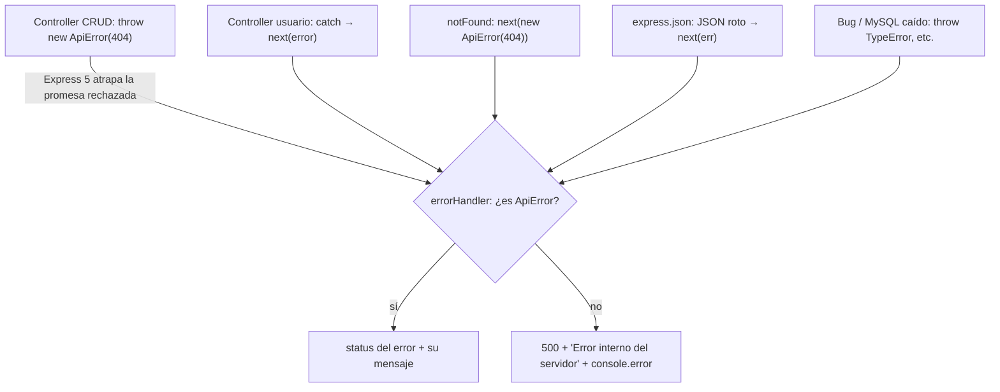

# Manejo de errores

> **Archivos:** [`src/utils/ApiError.js`](../../Navaja-Style/backend/src/utils/ApiError.js), [`src/middlewares/errorHandler.middleware.js`](../../Navaja-Style/backend/src/middlewares/errorHandler.middleware.js)
> **Depende de:** [03-middlewares.md](03-middlewares.md) · **Lo usan:** todos los controllers
> **Conceptos previos:** [middleware](glosario.md#middleware), [status code](glosario.md#status-code), [async / await](glosario.md#async--await)

## En una frase

Cualquier error, venga de donde venga, termina en **un único lugar** (`errorHandler`) que decide qué status code y qué mensaje ve el cliente, y se asegura de que **nunca** se filtren detalles internos del servidor.

## Dónde encaja



## ApiError

```js
// src/utils/ApiError.js:1-9
class ApiError extends Error {
  constructor(statusCode, message) {
    super(message);
    this.name = "ApiError";
    this.statusCode = statusCode;
  }
}

module.exports = ApiError;
```

- `class ApiError extends Error`: crea un **tipo de error propio** que *hereda* de `Error`, el error estándar de JavaScript. Heredar significa que un `ApiError` **es** un `Error` (tiene `message`, tiene *stack trace*, se puede lanzar con `throw`) pero con algo extra.
- `super(message)`: llama al constructor de `Error` para que haga su parte (guardar el mensaje y armar el *stack trace*, la lista de funciones que se estaban ejecutando cuando ocurrió el error). En una clase que hereda, **es obligatorio llamar a `super` antes de usar `this`**; si no, JavaScript lanza un `ReferenceError`.
- `this.statusCode = statusCode`: lo extra. Un `Error` común no tiene forma de decir "a esto le corresponde un 404"; `ApiError` sí.
- `this.name = "ApiError"`: es lo que aparece al imprimir el error (`ApiError: Producto con id 9 no encontrado`), útil al leer la consola.

**Por qué una clase y no `const e = new Error(); e.statusCode = 404`** (como en el [lab 4](../../Navaja-Style/apuntes/backend-lab-04-manejo-errores.md)): con una clase se puede preguntar `err instanceof ApiError`, que distingue con certeza **"este error lo lanzamos a propósito"** de "este error apareció por un bug". Con la propiedad suelta, cualquier error de una librería que casualmente tuviera `statusCode` se confundiría con uno nuestro.

## errorHandler: qué ve el cliente

```js
// src/middlewares/errorHandler.middleware.js:7-16
function errorHandler(err, req, res, next) {
  const statusCode = err instanceof ApiError ? err.statusCode : 500;
  const message = err instanceof ApiError ? err.message : "Error interno del servidor";

  if (!(err instanceof ApiError)) {
    console.error(err);
  }

  res.status(statusCode).json({ error: message });
}
```

(Por qué tiene 4 parámetros y por qué va último: [03-middlewares.md](03-middlewares.md#errorhandler-el-middleware-de-4-parámetros).)

- `err instanceof ApiError`: ¿el error es de nuestra clase? `instanceof` revisa si el objeto fue creado con esa clase (o una que herede de ella).
- `condición ? siUsí : siNo`: el **operador ternario**, un `if/else` en una sola expresión.
- **Si es un `ApiError`** → usamos su status y su mensaje. Lo escribimos nosotros, a propósito, pensando en que lo lea el cliente ("Producto con id 9 no encontrado").
- **Si no lo es** → siempre `500` y siempre `"Error interno del servidor"`, **nunca `err.message`**. **Por qué**: el mensaje real de un error inesperado puede revelar cómo está hecho el sistema por dentro. Por ejemplo, un error de MySQL puede decir `Table 'NavajaStyle.productos' doesn't exist` o `Duplicate entry 'x' for key 'uq_categorias_nombre'`: nombres de base, tablas y restricciones que le sirven a quien intenta atacar el sistema.
- `console.error(err)`: el error completo, con su *stack trace*, **sí** queda en la consola del servidor, que solo ven los desarrolladores. Los `ApiError` no se imprimen porque son situaciones esperadas (un 404 no es un problema del servidor).
- `{ error: message }`: **todas** las respuestas de error de la API tienen la misma forma. **Por qué**: el frontend puede mostrar `respuesta.error` sin importar qué endpoint falló.

## Express 5 atrapa los errores de las funciones async

Los controllers CRUD no tienen `try/catch` ni reciben `next`, y sin embargo sus `throw` llegan al `errorHandler`. Esto funciona por un cambio de **Express 5**.

Verificado en el paquete `router` 2.2.0 que usa Express 5 (`lib/layer.js:150-166`):

```js
try {
  const ret = fn(req, res, next)      // ejecuta el controller

  if (isPromise(ret)) {               // si devolvió una promesa (función async)...
    ret.then(null, function (error) { // ...y esa promesa se rechaza...
      next(error || new Error('Rejected promise'))  // ...manda el error a next
    })
  }
} catch (err) {
  next(err)                           // errores sincrónicos (sin async)
}
```

- **Errores sincrónicos** (en funciones normales): el `try/catch` de Express los atrapa. Esto ya pasaba en Express 4.
- **Errores en funciones `async`**: un `throw` dentro de una función `async` **no** sale como excepción; se convierte en una **promesa rechazada** que la función devuelve. El `try/catch` de afuera no la ve. Express 5 agrega el `.then(null, ...)`: se queda escuchando la promesa y, si se rechaza, llama a `next(error)`.
- **En Express 4** esa segunda parte no existía: la promesa rechazada quedaba sin manejar, el request colgado, y en Node 15+ el proceso entero se termina por *unhandled rejection*. Por eso, en código Express 4 se ve `try/catch` en cada handler o librerías como `express-async-errors`.

## Dos estilos conviviendo

| Estilo | Dónde | Cómo |
|---|---|---|
| `throw new ApiError(...)` | `utils/crud.controller.js` | Express 5 lleva el error al `errorHandler`, que responde. |
| `return res.status(4xx).json({ error })` + `try/catch` con `next(error)` | `usuario.controller.js`, `auth.controller.js`, `auth.middleware.js` | El controller responde los errores esperados él mismo; solo los inesperados van al `errorHandler`. |

- **Los dos producen la misma forma de respuesta** (`{ "error": "..." }`), así que el cliente no nota la diferencia.
- En Express 5, el `try { ... } catch (error) { next(error); }` es **redundante** para errores inesperados (Express haría lo mismo solo). Donde sí aporta es cuando se quiere **interceptar** un error concreto antes de que llegue al `errorHandler`, como hace el registro con `ER_DUP_ENTRY` → 409 ([05-controllers.md](05-controllers.md#crear-registro-post-apiauthregister)).
- Usar `ApiError` también en los controllers de usuario dejaría un único estilo. Hoy es una diferencia de criterio entre quienes escribieron cada parte, no un requisito técnico.

## Regla vs. convención

| Aspecto | ¿Regla o convención? | Por qué |
|---|---|---|
| `super(message)` en `ApiError` | Regla de JavaScript | Obligatorio antes de usar `this`. |
| No exponer `err.message` de errores inesperados | Regla de seguridad | Evita filtrar detalles internos. |
| `throw` en `async` sin `try/catch` | Funciona en Express 5 | El router escucha la promesa. |
| Formato `{ error: "..." }` | Convención del equipo | Facilita el manejo en el frontend. |
| Mezcla de `throw ApiError` y `res.status().json()` | Diferencia de estilo | Ambos funcionan. |

## Probalo

```bash
# ApiError de un controller CRUD → 404 con mensaje propio
curl -i http://localhost:3000/api/productos/99999

# Error inesperado (categoría duplicada → error de MySQL) → 500 genérico
curl -i -X POST http://localhost:3000/api/categorias \
  -H "Content-Type: application/json" -d '{"nombre": "Remeras"}'
curl -i -X POST http://localhost:3000/api/categorias \
  -H "Content-Type: application/json" -d '{"nombre": "Remeras"}'
```

La segunda creación responde `500 {"error":"Error interno del servidor"}` y en la consola del servidor aparece el error completo de MySQL (`ER_DUP_ENTRY`).

## Observaciones

- **Errores con status propio terminan en 500.** `errorHandler` solo respeta el status de los `ApiError`. Otros errores que ya traen un status correcto se pisan con 500:
  - JSON mal formado: `express.json()` manda un error con `status: 400` (verificado, `type: "entity.parse.failed"`), y el cliente recibe 500.
  - Una opción sería respetar también `err.status` cuando esté entre 400 y 499 (los errores de `body-parser` traen `expose: true`, que indica que su mensaje es seguro para mostrar).
- **Errores de MySQL esperables terminan en 500.** `ER_DUP_ENTRY` (repetido → debería ser 409), `ER_NO_REFERENCED_ROW_2` (foreign key inexistente → 400), `ER_ROW_IS_REFERENCED_2` (borrar algo en uso → 409) y violaciones de `CHECK` (→ 400) son errores del cliente, no del servidor. Se podrían traducir en un solo lugar (en el `errorHandler` o en `crud.controller.js`) mirando `err.code`, como ya se hace en el registro de usuarios.
