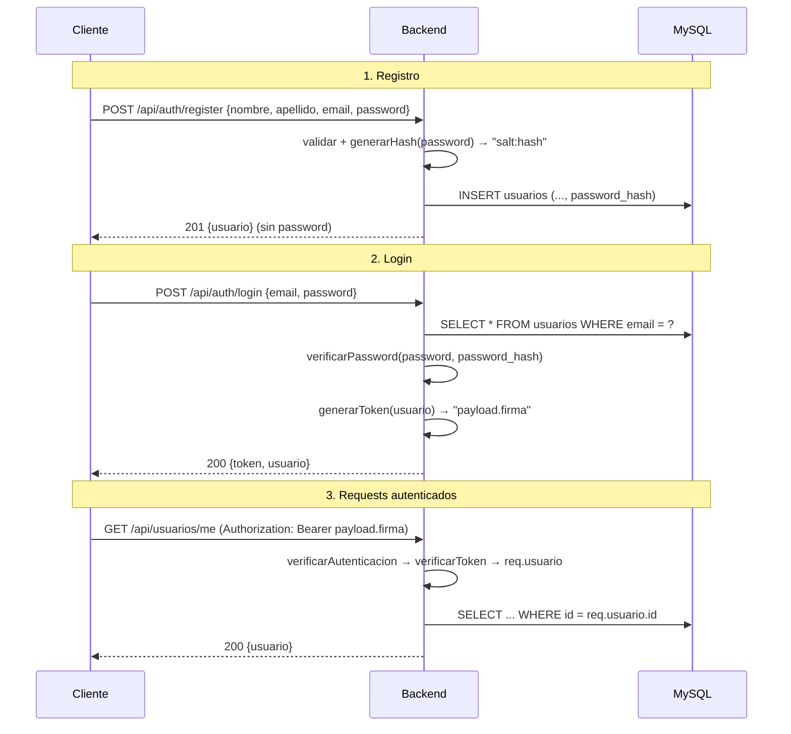

# Autenticación

> **Archivos:** [`src/utils/password.js`](../../Navaja-Style/backend/src/utils/password.js), [`src/utils/token.js`](../../Navaja-Style/backend/src/utils/token.js), [`src/middlewares/auth.middleware.js`](../../Navaja-Style/backend/src/middlewares/auth.middleware.js), [`src/controllers/auth.controller.js`](../../Navaja-Style/backend/src/controllers/auth.controller.js), [`src/controllers/usuario.controller.js`](../../Navaja-Style/backend/src/controllers/usuario.controller.js), [`src/models/usuario.model.js`](../../Navaja-Style/backend/src/models/usuario.model.js)
> **Depende de:** [03-middlewares.md](03-middlewares.md), [05-controllers.md](05-controllers.md)
> **Conceptos previos:** [hash](glosario.md#hash), [salt](glosario.md#salt), [token](glosario.md#token), [HMAC](glosario.md#hmac), [base64url](glosario.md#base64url), [header](glosario.md#header), [timing attack](glosario.md#timing-attack--comparación-en-tiempo-constante)

## En una frase

La autenticación responde **"¿quién sos?"**: el usuario se registra (guardamos un hash de su contraseña, nunca la contraseña), hace login (verificamos la contraseña y le damos un token firmado) y después manda ese token en cada request para demostrar quién es.

## El flujo completo



Todo está hecho con el módulo **`crypto` que trae Node.js**, sin librerías externas.

> ❓ Pendiente: ¿por qué se eligió implementar hash y token con `crypto` nativo en vez de librerías estándar como `bcrypt`/`argon2` y `jsonwebtoken`? (¿fin didáctico, evitar dependencias, otra razón?)

## Hash de contraseñas: `password.js`

### Por qué no guardar la contraseña

Si la base de datos se filtra (un backup expuesto, una SQL injection, un empleado curioso), las contraseñas en texto plano quedan a la vista, y como mucha gente repite contraseñas, el daño se extiende a otros sitios. Guardando un [hash](glosario.md#hash), quien robe la base ve `a3f9...:7c21...` y no puede volver atrás a la contraseña.

### `generarHash`

```js
// src/utils/password.js:3-17
function generarHash(password) {
  return new Promise((resolve, reject) => {
    const salt = crypto.randomBytes(16).toString("hex");

    crypto.scrypt(password, salt, 64, (error, hash) => {
      if (error) {
        return reject(error);
      }

      const passwordGuardado = salt + ":" + hash.toString("hex");

      resolve(passwordGuardado);
    });
  });
}
```

- `crypto.randomBytes(16)`: 16 bytes **aleatorios criptográficamente seguros** (impredecibles, a diferencia de `Math.random()`). Es el [salt](glosario.md#salt). `.toString("hex")` lo convierte en 32 caracteres hexadecimales (0-9, a-f) para poder guardarlo como texto.
  - **Por qué un salt distinto por usuario**: sin salt, dos usuarios con contraseña `123456` tendrían el mismo hash, y un atacante podría usar tablas precalculadas con los hashes de millones de contraseñas comunes. Con salt, cada hash es único y esas tablas no sirven.
- `crypto.scrypt(password, salt, 64, callback)`: **scrypt** es una función de hash **diseñada para contraseñas**: es deliberadamente **lenta y consume bastante memoria**. **Por qué lenta es bueno**: al usuario legítimo calcular un hash le cuesta milisegundos una vez por login; a un atacante que quiere probar miles de millones de contraseñas contra un hash robado, ese costo multiplicado lo vuelve impracticable. **Si se usara un hash rápido como SHA-256**, una placa de video podría probar miles de millones por segundo. El `64` es el largo del resultado en bytes.
- **Versión asíncrona (con callback) y no `scryptSync`**: Node atiende todos los requests en un único hilo. La versión con callback hace el cálculo pesado en un hilo aparte, así el servidor sigue atendiendo a otros mientras tanto. **Con `scryptSync`**, cada login frenaría a todo el servidor durante el cálculo.
- `new Promise((resolve, reject) => ...)`: `crypto.scrypt` avisa el resultado llamando a un callback, pero el resto del código usa `await`. Envolverlo en una promesa permite escribir `await generarHash(password)`. `resolve(valor)` cumple la promesa; `reject(error)` la rechaza. (Node también ofrece `util.promisify(crypto.scrypt)`, que hace lo mismo automáticamente.)
- `salt + ":" + hash`: se guarda **el salt junto al hash** en la misma columna (`password_hash`). El salt **no es secreto**: su función es hacer único cada hash, no esconderse. Pero hay que guardarlo, porque para verificar se necesita el mismo salt.

### `verificarPassword`

```js
// src/utils/password.js:19-49 (resumido)
const [salt, hashGuardado] = passwordGuardado.split(":");   // equivalente a partes[0], partes[1]
if (!salt || !hashGuardado) return resolve(false);

crypto.scrypt(password, salt, 64, (error, hashCalculado) => {
  const hashBuffer = Buffer.from(hashGuardado, "hex");
  if (hashBuffer.length !== hashCalculado.length) return resolve(false);
  resolve(crypto.timingSafeEqual(hashBuffer, hashCalculado));
});
```

- Un hash no se puede "deshacer", así que **para verificar se repite el cálculo**: se toma la contraseña que escribió el usuario, se le aplica scrypt **con el mismo salt guardado**, y se compara el resultado con el hash guardado. Si coinciden, la contraseña es la correcta.
- `if (!salt || !hashGuardado)`: si el valor guardado no tiene el formato `salt:hash` (dato corrupto o cargado a mano), responde "no coincide" en vez de explotar.
- `Buffer.from(hashGuardado, "hex")`: un **Buffer** es la forma en que Node representa bytes crudos. Convierte el texto hexadecimal de vuelta a bytes para compararlo con el resultado de scrypt (que ya es un Buffer).
- **Chequeo de largo antes de comparar**: `timingSafeEqual` **lanza un error** si los dos buffers tienen distinto largo (verificado: `ERR_CRYPTO_TIMING_SAFE_EQUAL_LENGTH`). El `if` previo lo evita.
- `crypto.timingSafeEqual(a, b)`: compara **todos los bytes siempre**, tarde lo mismo esté donde esté la diferencia. **Si se usara `===`** (que corta en el primer byte distinto), midiendo tiempos de respuesta un atacante podría deducir información. Ver [timing attack](glosario.md#timing-attack--comparación-en-tiempo-constante).

## Tokens: `token.js`

### Por qué un token

HTTP **no tiene memoria**: cada request llega solo, sin saber nada de los anteriores. Para no pedirle la contraseña al usuario en cada request, al hacer login se le entrega un **token**: un texto que dice "soy el usuario 7" y que **el servidor puede verificar que lo generó él**. El cliente lo guarda y lo manda en cada request.

### Formato: `payload.firma`

```js
// src/utils/token.js:3-31 (resumido)
const SECRETO = process.env.AUTH_SECRET;
const DURACION_SEGUNDOS = 60 * 60;

function crearFirma(datos) {
  return crypto.createHmac("sha256", SECRETO).update(datos).digest("base64url");
}

function generarToken(usuario) {
  const ahora = Math.floor(Date.now() / 1000);
  const payload = { id: usuario.id, email: usuario.email, rol: usuario.rol, exp: ahora + DURACION_SEGUNDOS };
  const payloadCodificado = base64Url(JSON.stringify(payload));
  const firma = crearFirma(payloadCodificado);
  return payloadCodificado + "." + firma;
}
```

Un token se ve así (dos partes separadas por un punto):

```
eyJpZCI6MSwiZW1haWwiOiJhbmFAbWFpbC5jb20iLCJyb2wiOiJjbGllbnRlIiwiZXhwIjoxNzk...  .  TLyWCZpkZ84AJGHx...
└──────────────────────── payload (datos en base64url) ──────────────────────┘     └──── firma ────┘
```

- **Payload**: `{ id, email, rol, exp }` pasado a JSON y luego a [base64url](glosario.md#base64url). **Ojo: base64url no es cifrado.** Cualquiera que tenga el token puede decodificarlo y leer el id, el email y el rol. Por eso **nunca** se pone información sensible en el payload.
- `exp` (*expiration*): momento de vencimiento, en **segundos** desde el 1/1/1970 (formato "Unix timestamp"). `Date.now()` da milisegundos, por eso se divide por 1000. Vence a la hora: **por qué vencer**: si un token se roba, solo sirve por un tiempo limitado.
- **Firma**: un [HMAC-SHA256](glosario.md#hmac) del payload calculado con `AUTH_SECRET`, una clave que **solo conoce el servidor**. Es lo que hace confiable al token: si alguien modifica el payload (por ejemplo, cambia `"rol":"cliente"` por `"rol":"admin"`), la firma ya no coincide, y no puede calcular una nueva porque no conoce la clave.
- `SECRETO` se lee **una vez, al cargar el módulo**. Por eso dotenv tiene que cargarse antes ([02-arranque.md](02-arranque.md#serverjs-el-punto-de-entrada)).
- Es el mismo principio que usa el estándar **JWT** (JSON Web Token), en versión simplificada: un JWT tiene tres partes (`header.payload.firma`), donde el header indica el algoritmo; acá el algoritmo está fijo en el código, así que se omite.

### `verificarToken`

```js
// src/utils/token.js:33-75 (resumido)
const partes = token.split(".");
if (partes.length !== 2) return null;

const firmaEsperada = crearFirma(payloadCodificado);
// mismo largo + timingSafeEqual(firmaRecibida, firmaEsperada) — si no coincide → null

const payload = JSON.parse(Buffer.from(payloadCodificado, "base64url").toString("utf8"));
if (payload.exp < ahora) return null;
return payload;
```

1. Separa payload y firma; si no son exactamente dos partes, el token es inválido.
2. **Recalcula la firma** del payload recibido con el secreto propio y la compara (en tiempo constante) con la firma recibida. Si alguien tocó el payload, no coinciden.
3. **Recién después** decodifica y parsea el payload. **Por qué en ese orden**: así nunca se procesan datos que no fueron generados por el servidor (un `JSON.parse` de basura lanzaría un error).
4. Chequea el vencimiento.
5. Devuelve el payload o `null`. Devolver `null` en todos los casos de falla (en vez de distintos errores) simplifica a quien lo usa: "o tengo usuario, o no".

## El middleware `verificarAutenticacion`

```js
// src/middlewares/auth.middleware.js:3-33 (resumido)
const header = req.headers.authorization;
if (!header) return res.status(401).json({ error: "Token no enviado" });

const partes = header.split(" ");
if (partes.length !== 2 || partes[0] !== "Bearer") {
  return res.status(401).json({ error: "Formato de token invalido" });
}

const payload = verificarToken(partes[1]);
if (!payload) return res.status(401).json({ error: "Token invalido o vencido" });

req.usuario = payload;
next();
```

- `req.headers.authorization`: Node pasa los nombres de headers a **minúsculas**, por eso se lee `authorization` aunque el cliente mande `Authorization`.
- `Bearer <token>`: es el **formato estándar** (esquema "Bearer", "portador") para mandar tokens en HTTP: "el que porta este token es quien dice ser". Usar el estándar hace que herramientas como Postman, la extensión REST Client o `fetch` lo manejen sin configuración especial.
- **401 Unauthorized** en los tres casos: significa "no sé quién sos" (falta o no sirve la credencial). Es distinto de **403 Forbidden**: "sé quién sos, pero no tenés permiso".
- `req.usuario = payload`: **agrega** los datos del usuario al request. Como `req` es el mismo objeto a lo largo de toda la cadena, el controller que viene después puede leer `req.usuario.id`. Es la forma estándar en Express de pasar información de un middleware al siguiente.
- `next()`: solo si todo salió bien. Ver [cómo termina un middleware](03-middlewares.md#cómo-funciona-un-middleware).

## Login: `auth.controller.js`

```js
// src/controllers/auth.controller.js:33-56
const usuario = await usuarioModel.buscarPorEmail(emailNormalizado);

if (!usuario) {
  return res.status(401).json({ error: "Email o contraseña incorrectos" });
}

const passwordCorrecto = await verificarPassword(password, usuario.password_hash);

if (!passwordCorrecto) {
  return res.status(401).json({ error: "Email o contraseña incorrectos" });
}

if (!usuario.activo) {
  return res.status(403).json({ error: "Usuario inactivo" });
}
```

- Antes de esto valida el body y normaliza el email igual que el registro (`trim().toLowerCase()`), para que `Ana@Mail.com ` encuentre a `ana@mail.com`.
- **Mismo mensaje si el email no existe o si la contraseña está mal.** **Por qué**: si dijera "ese email no existe", cualquiera podría averiguar qué emails tienen cuenta (*enumeración de usuarios*) y después concentrar ataques en esas cuentas.
- **El chequeo de `activo` va después de verificar la contraseña** (commit `75ddc0a`, "Mejorar validación de usuario inactivo"; antes estaba antes). **Por qué**: así el estado de la cuenta ("inactiva") solo se le revela a alguien que demostró conocer la contraseña. Con el orden anterior, cualquiera podía saber que un email estaba registrado e inactivo sin saber la contraseña.
- **403** (no 401) para el usuario inactivo: las credenciales son correctas (sabemos quién es), pero no tiene permitido entrar.
- La respuesta incluye el `token` y un objeto `usuario` armado campo por campo, **sin `password_hash`**.

## Regla vs. convención

| Aspecto | ¿Regla o convención? | Por qué |
|---|---|---|
| Hashear contraseñas con salt | Regla de seguridad | Protege si se filtra la base. |
| Función lenta (scrypt), no SHA-256 | Regla de seguridad | Encarece los ataques de fuerza bruta. |
| `timingSafeEqual` para hashes y firmas | Regla de seguridad | Evita timing attacks. |
| `AUTH_SECRET` fuera del código | Regla de seguridad | Quien tenga la clave puede fabricar tokens. |
| Mismo mensaje para email/contraseña incorrectos | Buena práctica | Evita enumerar usuarios. |
| Header `Authorization: Bearer` | Estándar HTTP | Compatibilidad con herramientas. |
| Formato propio `payload.firma` | Decisión del equipo | Similar a JWT, sin la librería. |
| Duración de 1 hora | Decisión del equipo | Compromiso entre seguridad y comodidad. |

## Probalo

```bash
# Registro
curl -i -X POST http://localhost:3000/api/auth/register \
  -H "Content-Type: application/json" \
  -d '{"nombre":"Ana","apellido":"Pérez","email":"ana@mail.com","password":"secreto123"}'

# Login → copiar el "token" de la respuesta
curl -s -X POST http://localhost:3000/api/auth/login \
  -H "Content-Type: application/json" \
  -d '{"email":"ana@mail.com","password":"secreto123"}'

# Usar el token
curl -i http://localhost:3000/api/usuarios/me -H "Authorization: Bearer <token>"

# Leer el payload de un token (demuestra que NO está cifrado)
node -e "console.log(Buffer.from(process.argv[1].split('.')[0], 'base64url').toString())" "<token>"
```

## Errores comunes

- **`401 Formato de token invalido`** → falta la palabra `Bearer` o hay espacios de más (`Bearer  token`).
- **Todos los tokens dejan de servir después de reiniciar** → cambió `AUTH_SECRET` en el `.env`. Los tokens firmados con la clave anterior ya no validan.
- **`401 Token invalido o vencido` a la hora** → es el vencimiento esperado; hay que volver a hacer login.

## Observaciones

- **`AUTH_SECRET` vacío o ausente no se detecta.** `.env.example` trae `AUTH_SECRET=` vacío. Si se copia así, la clave es el texto vacío: `createHmac` lo acepta sin error (verificado) y **cualquiera que sepa que está vacía puede fabricar tokens válidos** con el rol que quiera. Si directamente falta, `createHmac` lanza `ERR_INVALID_ARG_TYPE` y el login responde 500. Convendría validar al arrancar que exista y tenga un largo mínimo.
- **Los tokens no se pueden revocar.** Son válidos durante su hora aunque el usuario se desactive, cambie la contraseña o "cierre sesión". `verificarAutenticacion` no consulta la base. Es el costo habitual de los tokens sin estado; se mitiga con duraciones cortas o chequeando `activo` en los endpoints sensibles.
- **El `rol` del token todavía no se usa** para autorizar nada (ver [04-rutas.md](04-rutas.md#observaciones)). Cuando se use, tener en cuenta que un cambio de rol no se refleja hasta que el usuario vuelva a loguearse.
- **Diferencia de tiempo en el login**: si el email no existe, se responde sin calcular scrypt (rápido); si existe, se calcula (lento). Midiendo tiempos se podría saber qué emails están registrados, lo que debilita el "mismo mensaje" de arriba. De todas formas, el registro ya revela si un email existe (responde 409).
- **El `README.md` y `api-test.http` siguen apuntando a `/api/auth/me`**, que fue reemplazado por `/api/usuarios/me`.
